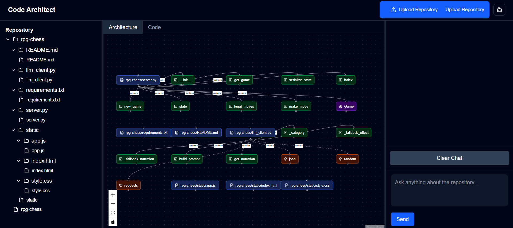

#  Code Architect

> An original AI-powered repository analysis using Retrieval-Augmented Generation (RAG), multi-agent reasoning, and semantic code search.


---

##  Overview

Code Architect is an AI-powered repository analysis platform that helps developers understand unfamiliar codebases through natural language.

Upload a GitHub repository or ZIP archive and ask questions like:

- *How is this project structured?*
- *Explain the authentication flow.*
- *Where is the database initialized?*
- *Generate project documentation.*
- *Review the architecture.*
- *Identify design patterns.*

Instead of manually exploring hundreds of files, Code Architect retrieves the most relevant code using vector search and allows specialized AI agents to reason over the repository.

---

##  Features

-  Upload ZIP repositories
-  Multi-Agent AI architecture
-  Semantic code search using RAG
-  Repository-aware conversations
-  Automatic repository parsing
-  AI-generated project documentation
-  Downloadable PDF documentation
-  Interactive repository explorer
-  Markdown rendering
-  Cloud deployment
-  FastAPI REST backend
-  Modern Next.js interface

---

#  Screenshots

### Dashboard



### AI Chat


### Documentation PDF

[View Sample Documentation](docs/Repository_Documentation.pdf)

---

#  System Architecture

```text
                 User
                  │
                  ▼
         Next.js Frontend
                  │
                  ▼
          FastAPI Backend
                  │
      ┌───────────┼────────────┐
      │           │            │
      ▼           ▼            ▼
 Repository   Multi-Agent   Qdrant
  Parser        Router      Vector DB
      │                        │
      ▼                        ▼
 Chunking               Semantic Search
      │                        │
      └──────────┬─────────────┘
                 ▼
         Hugging Face LLM
                 │
                 ▼
           Final Response
```

---

#  AI Pipeline

1. Upload repository
2. Extract project structure
3. Parse source files
4. Split code into semantic chunks
5. Generate embeddings
6. Store vectors in Qdrant
7. Route question through Supervisor Agent
8. Retrieve relevant context
9. Generate AI response
10. Render answer or generate PDF

---

#  Multi-Agent Architecture

Instead of relying on a single prompt, Code Architect routes requests through specialized AI agents.

## Repository Agent

- Repository exploration
- File lookup
- Code explanation

---

## Architecture Agent

- Component relationships
- Design patterns
- Dependency analysis
- Project structure

---

## Documentation Agent

- README generation
- Technical documentation
- PDF export

---

## Review Agent

- Code quality
- Best practices
- Suggestions
- Refactoring advice

---

## Supervisor Agent

Determines which specialist should answer each user request.

---

#  Tech Stack

## Frontend

- Next.js
- React
- TypeScript
- Tailwind CSS
- React Markdown

## Backend

- FastAPI
- Python
- Pydantic
- Uvicorn

## AI

- Hugging Face Inference API
- RAG
- Multi-Agent Architecture

## Vector Database

- Qdrant Cloud

## Deployment

- Vercel
- Render

---

#  Project Structure

```text
Code-Architect/

├── frontend/
│   ├── app/
│   ├── components/
│   ├── context/
│   └── lib/
│
├── backend/
│   ├── api/
│   ├── services/
│   ├── agents/
│   ├── models/
│   ├── core/
│   └── generated/
│
└── README.md
```

---

#  Installation

## Clone

```bash
git clone https://github.com/yourusername/code-architect.git
```

---

## Backend

```bash
cd backend

python -m venv .venv

source .venv/bin/activate
# Windows
.venv\Scripts\activate

pip install -r requirements.txt
```

Run

```bash
uvicorn app.main:app --reload
```

---

## Frontend

```bash
cd frontend

npm install

npm run dev
```

---

# 🔑 Environment Variables

Backend

```env
HF_TOKEN=

QDRANT_URL=

QDRANT_API_KEY=

COLLECTION_NAME=repository_chunks
```

Frontend

```env
NEXT_PUBLIC_API_URL=http://localhost:8000
```

---

#  Example Questions

- Explain this project.
- How is authentication implemented?
- What is the application architecture?
- Generate project documentation.
- Explain the API flow.
- Review the repository.
- Identify design patterns.
- Summarize the backend.

---

# Future Improvements

- More languages support
- GitHub repository cloning
- Code graph visualization
- Mermaid architecture diagrams
- Local LLM support
- Docker deployment
- Electron desktop application
- Authentication
- Repository history
- CI/CD integration

---

#  Why Code Architect?

Large repositories are difficult to understand and traditional search only finds keywords.

Code Architect brings all in one to provide repository-aware AI assistance:

- Retrieval-Augmented Generation
- Semantic Search
- Multi-Agent Reasoning


---

#  Author

**Hafsa Rafique**

AI Engineer | Computer Vision | Generative AI


---

# ⭐ If you found this project interesting

Give it a ⭐ on GitHub!
