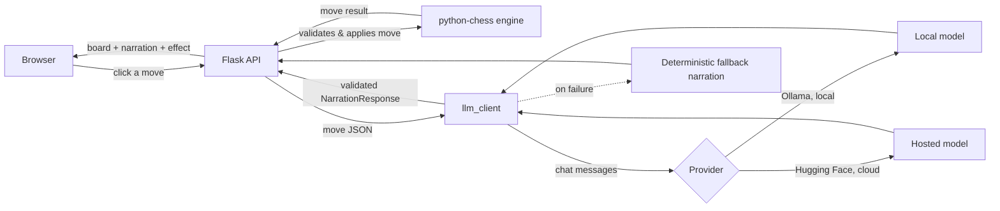

# Runebound Chess

Real 2-player chess (hot-seat, one board, alternating turns) where every move
is narrated by an **LLM acting as an RPG battle announcer**, with a matching
spell-effect animation on the board. The model decides both what's said and
which visual effect fires — the chess engine handles the rules, the LLM
handles the storytelling.

This project doubles as a small, self-contained demonstration of
**LLM-in-the-loop application design**: structured output validation,
bounded retries, deterministic fallback, provider abstraction, an eval
harness, and a test suite — the parts of shipping an LLM feature that don't
show up in a demo GIF.

## Why this project exists

Anyone can call `chat.completions.create()` once and print the result. The
interesting engineering problem is everything around that call:

- What happens when the model returns malformed JSON?
- What happens when it's slow, rate-limited, or just offline?
- How do you know — quantitatively — whether your prompt is any good?
- How do you swap providers, or the model's "voice," without touching
  business logic?

This project answers each of those in miniature, using chess narration as
a deliberately small, low-stakes domain where the answers are easy to see.

## How it works



- **Chess engine** (`server.py`, Flask): real rules via `python-chess` —
  legal move validation, check/checkmate/stalemate, castling, en passant,
  promotion. This layer never depends on the LLM being available.
- **LLM layer** (`llm_client.py`): after each move, sends structured move
  data (piece, captured piece, check/checkmate/castle flags, etc.) as a
  chat message to the configured provider and asks for JSON: a one-line
  dramatic narration + a spell-effect name. See
  [Engineering notes](#engineering-notes) below for how this is made
  reliable.
- **Frontend** (`static/`): a hand-drawn dark-arcane chessboard. Clicking a
  piece highlights legal moves; making a move triggers a particle burst
  matching the model's chosen effect, and the narration is appended to
  "The Chronicle" scroll panel (with the model source + latency shown per
  entry). A connection indicator shows whether the narrator is actually
  reachable or running on scripted fallback.

## Engineering notes

The parts of this project most worth reading if you're evaluating it as a
portfolio piece, all in `llm_client.py`:

- **Structured output, validated, not trusted.** The model is asked for
  JSON and the response is parsed into a `pydantic.BaseModel`
  (`NarrationResponse`) with real constraints — effect must be one of a
  fixed enum, narration must be non-empty and length-bounded. A model that
  "mostly" follows instructions is not the same as one that's contractually
  bounded; this makes the gap explicit and closes it.
- **Bounded retries, fail-fast on permanent errors.** Transient failures
  (timeouts, a single malformed response) get retried with backoff up to
  `LLM_MAX_ATTEMPTS`. Permanent misconfiguration (e.g. a missing
  `HF_TOKEN`) is detected and skips the retry budget entirely — retrying a
  request that can never succeed just adds latency.
- **Deterministic fallback, always.** If every attempt fails, the game
  never breaks — a rule-based narrator (`_fallback_narration`) produces a
  perfectly serviceable line, and the response says so (`source:
  "fallback"`) instead of pretending the LLM produced it.
- **Provider abstraction.** `llm_client.py` exposes one function,
  `get_narration()`, to the rest of the app. Ollama and Hugging Face are
  both just chat-message-in, text-out — adding a third provider (OpenAI,
  Anthropic, vLLM, whatever) means adding one `_call_x()` function, not
  touching `server.py` at all.
- **Prompt/persona separation.** The narrator's voice
  (`NARRATOR_PERSONAS`) lives entirely in the system prompt and is
  selected per-game. Move data and output-format instructions live in the
  user prompt and never change. This is the same shape you'd use for
  "brand voice" or "user-selectable tone" in a production app.
- **Observability by default.** Every narration response carries
  `source` and `latency_ms`. You can't tell if an LLM feature is healthy
  in production if you don't measure it, so the app measures it from day
  one and surfaces it in the UI, not just the logs.

## Evaluation harness

`eval/run_eval.py` runs a fixed battery of synthetic chess scenarios
(quiet move, capture, check, checkmate, castle, promotion, stalemate)
through the **actual configured provider** and reports:

- **fallback rate** — how often the LLM path failed and fallback kicked in
- **schema-valid rate** — how often the raw output parsed and validated
- **mood agreement rate** — a cheap heuristic checking whether dramatic
  moments (checkmate, check, captures) get a "heavy" effect
  (`explosion`/`dark`/`holy`/`lightning`) rather than something like
  `sparkle` — a stand-in for "is the model actually reading the input"
- **latency** (mean / p50 / p95)

```bash
python eval/run_eval.py                    # uses your current .env / provider
python eval/run_eval.py --repeats 5 --persona whimsical
python eval/run_eval.py --out results.json # write the full JSON report
```

Chess narration is a nice small domain for this: inputs are fully
enumerable, the output *shape* is fully known in advance, and "is the
model paying attention" can be checked with a cheap heuristic instead of a
second LLM-as-judge call. If the configured provider is unreachable, every
scenario will (by design) hit the fallback path — the report calls this
out explicitly rather than silently reporting misleading numbers.

## Testing

```bash
pip install -r requirements.txt pytest
pytest -v
```

35 tests, no network access required:

- `tests/test_server.py` — API-level tests against the real chess engine:
  legal move generation, illegal-move rejection, Fool's Mate reaching
  checkmate, castling flags, independent per-game state, health/persona
  endpoints. LLM calls are monkeypatched to a stub so these run in
  milliseconds.
- `tests/test_llm_client.py` — unit tests for the LLM layer in isolation:
  JSON extraction from messy model output (markdown fences, stray prose),
  schema validation (rejecting unknown effects, empty narration,
  truncating runaway generations), retry behavior (succeeds after one
  transient failure, exhausts retries and falls back, skips retries on
  permanent config errors), and persona wiring. All network calls are
  faked with `monkeypatch`.

CI (`.github/workflows/ci.yml`) runs `ruff check` and the full test suite
on Python 3.11 and 3.12 on every push, plus a Docker build sanity check.

## Setup

### 1. Install Ollama and pull a model

```bash
# macOS / Linux
curl -fsSL https://ollama.com/install.sh | sh

# pull an open-source model (pick one that fits your hardware)
ollama pull llama3.2        # ~2GB, fast, good default
# or: ollama pull qwen2.5:7b
# or: ollama pull mistral

# Ollama usually runs as a background service on localhost:11434.
# If not, start it manually:
ollama serve
```

If you use a different model name, update `OLLAMA_MODEL` in `.env`.

### 2. Install Python dependencies

```bash
python -m venv venv
source venv/bin/activate        # Windows: venv\Scripts\activate
pip install -r requirements.txt
```

### 3. Run the app

```bash
python server.py
```

Open **http://localhost:5000** in your browser. Two people share the same
screen/keyboard and take turns clicking moves (classic hot-seat chess).
Pick a narrator persona from the dropdown before starting a new battle.

## Choosing your LLM backend

The app supports two backends, switched with one environment variable
(`LLM_PROVIDER`). Copy `.env.example` to `.env` and fill in what you need.

### Option 1: Ollama (fully self-hosted, local)

Everything, including the model weights, runs on your own machine — no
API key, no cloud, no per-call cost. The tradeoff: your machine (or
whatever server it's on) has to be running and reachable whenever anyone
plays, which means tunneling (see the Deployment section below) if you
want to share it.

```bash
curl -fsSL https://ollama.com/install.sh | sh
ollama pull llama3.2
```
```
# .env
LLM_PROVIDER=ollama
OLLAMA_HOST=http://localhost:11434
OLLAMA_MODEL=llama3.2
```

### Option 2: Hugging Face Inference Providers (cloud, needs an API key)

The model itself is still open-source (Llama, Qwen, Mistral, etc.) — it's
just hosted on Hugging Face's infrastructure instead of yours. This is the
easier path if you want to deploy the app to a real server: since there's
no "localhost" the LLM depends on, your Flask app can run anywhere and
just make an outbound HTTPS call.

1. Create a token at https://huggingface.co/settings/tokens — a
   fine-grained token with **"Make calls to Inference Providers"**
   permission is enough. No dedicated GPU or endpoint needed.
2. Set:
```
# .env
LLM_PROVIDER=huggingface
HF_TOKEN=hf_xxxxxxxxxxxxxxxxxxxxxxxxxxxxxxxx
HF_MODEL=meta-llama/Llama-3.2-3B-Instruct
```
Any chat-capable model on the Hugging Face Hub that has an available
Inference Provider works — swap `HF_MODEL` for anything from
https://huggingface.co/models?inference_provider=all&pipeline_tag=text-generation.

**Free-tier notes:** Hugging Face's free tier has rate limits and can have
a short "cold start" delay the first time a given model is called after
being idle — the app's fallback narration kicks in automatically if a
call times out or fails after retries, so the game never stalls. For
steady traffic, either accept occasional fallback lines on the free tier,
or use a paid Inference Provider / dedicated Inference Endpoint for
guaranteed capacity.

**Never commit `HF_TOKEN` to source control.** Put it in `.env` (already
gitignored) or your hosting platform's environment variable settings.

## Testing in Google Colab

`colab_test.ipynb` is included for quick, no-install testing — useful for
trying the game or showing it to someone before you set up real hosting.

1. Go to https://colab.research.google.com, choose **Upload**, and select
   `colab_test.ipynb` from this project.
2. Run the cells top to bottom. The first cell asks you to upload
   `rpg-chess.zip` (the whole project, zipped) into the Colab session.
3. You'll be prompted for a Hugging Face token — the notebook uses the
   `huggingface` LLM backend, since Colab doesn't reliably support running
   a background Ollama server, and this app doesn't need a GPU anyway.
4. The last setup cell prints a public URL (via ngrok) — open it or share
   it with whoever you're playing with.

This is for **testing only**: Colab sessions time out after a period of
inactivity (or at most ~12 hours), so it's not a real deployment. Once
you're happy with it, move to Docker/cloud below.

## Deployment

Two different goals, two different answers.

### A. Just want two people to play on the same network

You don't need to "deploy" anything — run it on one machine and have the
other player join over Wi-Fi:

```bash
python server.py
```

Find your machine's LAN IP (`ipconfig` on Windows, `ifconfig`/`ip a` on
Mac/Linux — something like `192.168.1.42`), then the second player opens
`http://192.168.1.42:5000` on their own device, on the same network.

### B. Test it with Docker locally first

Regardless of which cloud you deploy to next, it's worth running the exact
container locally first so you know it works before paying for a server.

**With Hugging Face** (simpler — recommended default):
```bash
docker build -t rpg-chess .
docker run -p 5000:5000 \
  -e LLM_PROVIDER=huggingface \
  -e HF_TOKEN=hf_xxxxxxxxxxxxxxxxxxxxxxxxxxxx \
  -e HF_MODEL=meta-llama/Llama-3.2-3B-Instruct \
  rpg-chess
```
Visit `http://localhost:5000` — if it works here, it'll work identically
wherever you deploy the container.

**With Ollama** (fully self-hosted, both containers on your machine):
```bash
docker compose up -d
docker compose exec ollama ollama pull llama3.2
```
Visit `http://localhost:5000`.

### C. Deploy to an actual cloud host

Once the container works locally, here are three concrete ways to put it
somewhere permanent. All three assume the Hugging Face backend, since it
needs no local machine at all — pick whichever platform fits your comfort
level.

**C1. Render.com (easiest, has a free tier)**
1. Push this project to a GitHub repo.
2. In Render: **New → Web Service**, connect the repo, choose
   **Docker** as the environment (it auto-detects the `Dockerfile`).
3. Add environment variables in the Render dashboard:
   `LLM_PROVIDER=huggingface`, `HF_TOKEN=...`, `HF_MODEL=...`.
4. Deploy. Render gives you a `https://your-app.onrender.com` URL
   automatically — HTTPS included, no reverse proxy needed.

**C2. Railway.app (also very quick)**
1. Push to GitHub, then in Railway: **New Project → Deploy from GitHub
   repo**. It detects the `Dockerfile` automatically.
2. Add the same three environment variables under the service's
   **Variables** tab.
3. Railway assigns a public URL under **Settings → Networking → Generate
   Domain**.

**C3. A plain VPS (DigitalOcean, Hetzner, Linode — full control)**
```bash
# on the server, after installing Docker:
git clone <your-repo-url>
cd rpg-chess
docker build -t rpg-chess .
docker run -d -p 5000:5000 --restart unless-stopped \
  -e LLM_PROVIDER=huggingface \
  -e HF_TOKEN=hf_xxxxxxxxxxxxxxxxxxxxxxxxxxxx \
  -e HF_MODEL=meta-llama/Llama-3.2-3B-Instruct \
  rpg-chess
```
Then put a domain + HTTPS in front with Caddy (simplest reverse proxy —
auto-fetches a TLS cert for you):
```
# /etc/caddy/Caddyfile
yourdomain.com {
    reverse_proxy localhost:5000
}
```
```bash
sudo systemctl reload caddy
```

**If you want Ollama instead of Hugging Face on any of these:** you'd need
a host with real RAM (8GB+ minimum) and would deploy `docker-compose.yml`
(both the `app` and `ollama` services) rather than a single container —
Render/Railway's free tiers generally don't have enough RAM for this, so a
VPS (option C3) is the realistic choice for self-hosted Ollama in
the cloud.

**Important either way:** always run with `--workers 1` (already set in
the `Dockerfile`'s gunicorn command). Game state lives in an in-memory
Python dict guarded by a per-game lock, which only works correctly within
a single process — multiple worker processes would each keep their own
separate, inconsistent copy of the board. Scale beyond one process only
after moving `games` to Redis or a small database.

## Extending it

- **Network multiplayer**: give each game a real `game_id`, add a second
  route/socket per player, and use a WebSocket (Flask-SocketIO) instead of
  polling `/api/state`, so both browsers update live.
- **A third LLM provider**: add one `_call_x()` function in
  `llm_client.py` alongside `_call_ollama` / `_call_huggingface`, wire it
  into `_call_provider()`, and it inherits retries, validation, and
  fallback for free.
- **More personas**: add an entry to `NARRATOR_PERSONAS` — no other code
  changes needed, and it shows up in the frontend dropdown automatically
  via `/api/personas`.
- **Voice**: pipe the narration text through a local TTS engine (e.g.
  Piper, also open-source and self-hosted) to have the battle narrated
  aloud.
- **Board skins**: the effect classes are plain CSS in `style.css` — add
  new ones and teach `VALID_EFFECTS`/the prompt about the new names.
- **LLM-as-judge eval**: extend `eval/run_eval.py` to score narration
  *quality* (not just schema validity) with a second model call, for a
  fuller picture than the current heuristic.

## Project layout

```
rpg-chess/
├── server.py               # Flask backend + chess rules
├── llm_client.py            # Provider abstraction, prompts, retries, validation, fallback
├── requirements.txt
├── pyproject.toml           # ruff + pytest config
├── Makefile                 # install / run / test / lint / eval shortcuts
├── Dockerfile                # gunicorn, single worker (in-memory game state)
├── docker-compose.yml        # app + Ollama, for fully self-hosted deployment
├── .env.example              # copy to .env and fill in your provider's settings
├── .github/workflows/ci.yml  # lint + test on every push, Python 3.11 & 3.12
├── colab_test.ipynb          # quick no-install testing in Google Colab
├── eval/
│   └── run_eval.py           # evaluation harness for the narration layer
├── tests/
│   ├── test_server.py        # API-level tests against the real chess engine
│   └── test_llm_client.py    # unit tests for retries, validation, fallback
├── static/
│   ├── index.html
│   ├── style.css              # dark-arcane theme + spell-effect animations
│   └── app.js                 # board rendering, chronicle log, health check, effects
└── README.md
```
